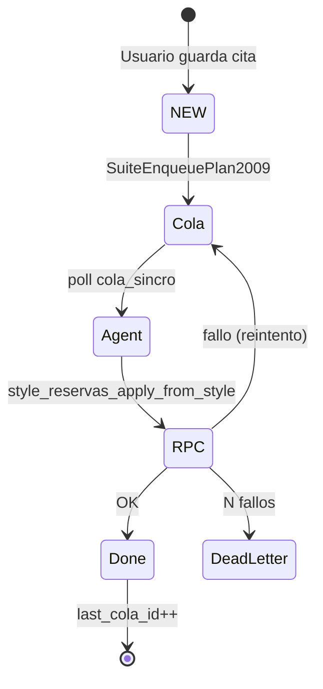
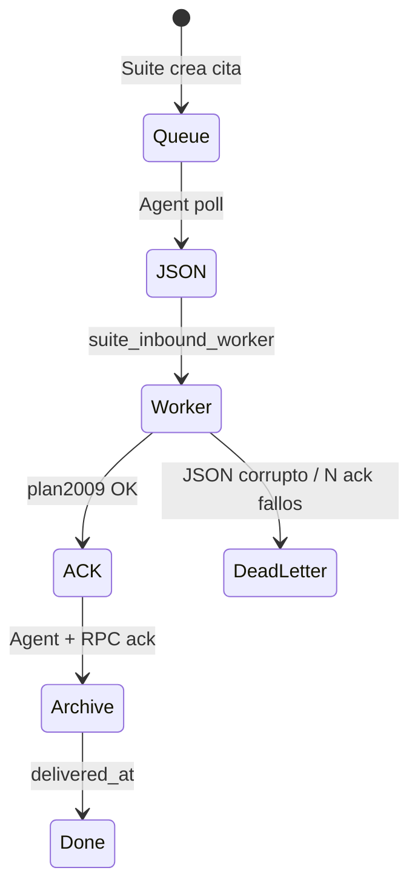
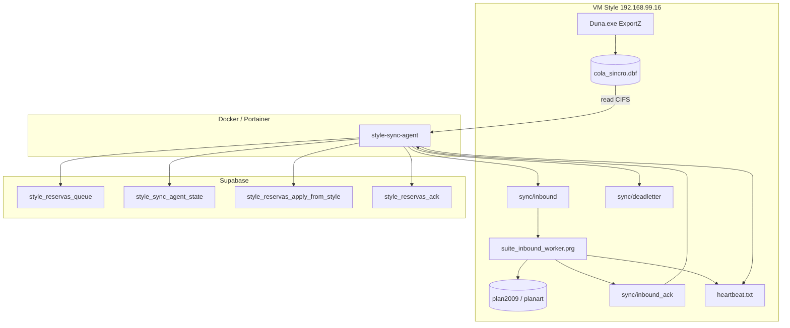

# STYLE ↔ SUITE — Arquitectura v2 (cola + agente Docker)

## Reglas de oro

1. **VFP nunca habla con Supabase.**
2. **Node nunca escribe DBF.**
3. **Todo cambio pasa por una cola.**
4. **Las operaciones son idempotentes.**
5. **Se acepta entrega al menos una vez (at-least-once).**
6. **El sistema debe recuperarse automáticamente.**
7. **El heartbeat debe estar siempre vivo.**
8. **Nunca ejecutar v1 (HTTP) y v2 simultáneamente** — kill switch en `control_sincro.dbf` (`modo_activo`: `1`=v1, `2`=v2). Agente y worker comprueban antes de cada ciclo.

---

## Garantías del sistema

### Style → Suite

| Garantía | Mecanismo |
|----------|-----------|
| At-least-once | Cola persiste hasta que el agente confirma RPC |
| Idempotente | RPC `style_reservas_apply_from_style` por `idplan` |
| Nunca se pierde una cita | `last_cola_id` **no avanza** si el RPC falla |
| Sin reprocesados infinitos | `last_cola_id` solo avanza tras éxito |

### Suite → Style

| Garantía | Mecanismo |
|----------|-----------|
| At-least-once | `style_reservas_queue` hasta `style_reservas_ack` |
| JSON + ACK | Separación escritura (Node) / aplicación (VFP) |
| Last-write-wins | LWW en Postgres + worker VFP (`sync_version` en `plan2009`) |
| ACK siempre | Worker genera `.ok` aunque Style pierda el conflicto (evita reintentos infinitos) |

---

## Ownership

| Elemento | Dueño | Escritura |
|----------|-------|-----------|
| `plan2009.dbf` | VFP | Solo worker / Style POS |
| `planart.dbf` | VFP | Solo worker / Style POS |
| `cola_sincro.dbf` | VFP | `SuiteEnqueuePlan2009` |
| `control_sincro.dbf` | VFP | Kill switch `modo_activo` |
| `sync/inbound/` | Node | JSON desde queue Postgres |
| `sync/inbound_ack/` | VFP | Worker tras aplicar DBF |
| `sync/deadletter/` | Node | Tras N fallos → revisión manual |
| `sync/archive/` | Node | Tras ack OK |
| `style_reservas_queue` | Supabase | Dual-write Suite |
| `agenda_appointments` | Supabase | Suite |
| `last_cola_id` | Node | `style_sync_agent_state` |

**Node nunca modifica DBF.**

---

## Máquina de estados

### Outbound (Style → Suite)



```
NEW → cola_sincro.dbf → Agent → RPC apply → last_cola_id → DONE
                              ↘ (N fallos) → sync/deadletter/outbound/
```

### Inbound (Suite → Style)



```
Queue → JSON → Worker VFP → ACK → Archive → DONE
```

---

## Diagrama de componentes



---

## v1 vs v2

| | v1 (legacy) | v2 (actual) |
|---|-------------|-------------|
| Outbound | HTTP MSXML en exe | `cola_sincro.dbf` |
| Inbound | HTTP pull XML | JSON + worker VFP |
| Agente | Timer embebido / Python | Node Docker |
| Riesgo 1732 | Alto (unlock embebido) | Bajo (exe thin) |

**No ejecutar v1 y v2 en paralelo.** Usar `control_sincro.modo_activo = '2'` solo cuando v2 está desplegado; volver a `'1'` en rollback.

### Contrato `cola_sincro.servicios` (Memo)

JSON array (mismo formato en cola, agente Node y worker VFP):

```json
[{"servicio":"corte","hora":"10:00"},{"servicio":"tinte","hora":"11:00"}]
```

El agente convierte a texto legacy para el RPC Postgres (`codart+hora` por línea). El worker inbound parsea JSON con `SuiteJsonParse` o cae al formato legacy si no empieza por `[`.

### LWW inbound (worker VFP)

1. Resolver `version` del JSON (campo `version` o `modificado`).
2. Comparar con `plan2009.sync_version` local.
3. Si entrante ≤ local → ignorar escritura, **pero generar ACK** (`applied=0`).
4. Si entrante > local o INS nuevo → aplicar y `REPLACE sync_version`.

---

## Documentos relacionados

- [STYLE-SUITE-DEPLOY.md](STYLE-SUITE-DEPLOY.md)
- [STYLE-SUITE-OPERATIONS.md](STYLE-SUITE-OPERATIONS.md)
- [STYLE-SUITE-TROUBLESHOOTING.md](STYLE-SUITE-TROUBLESHOOTING.md)
- [STYLE-SUITE-HISTORY.md](STYLE-SUITE-HISTORY.md)
- [STYLE-SUITE-SYNC-V2-IMPLEMENTACION.md](STYLE-SUITE-SYNC-V2-IMPLEMENTACION.md)
