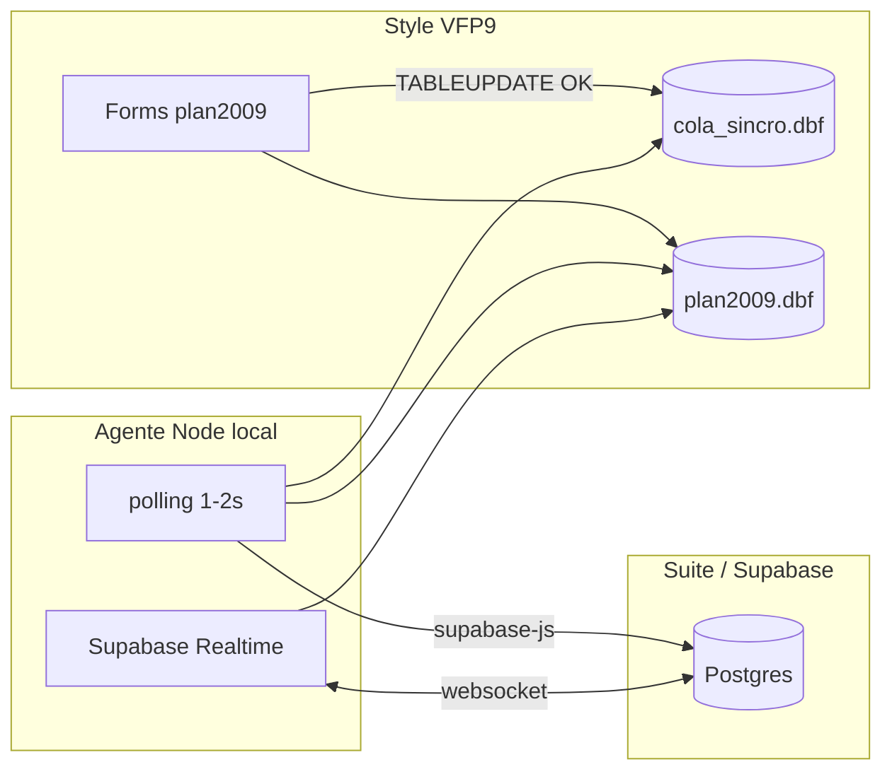
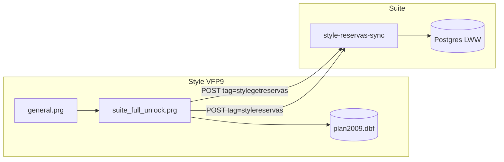
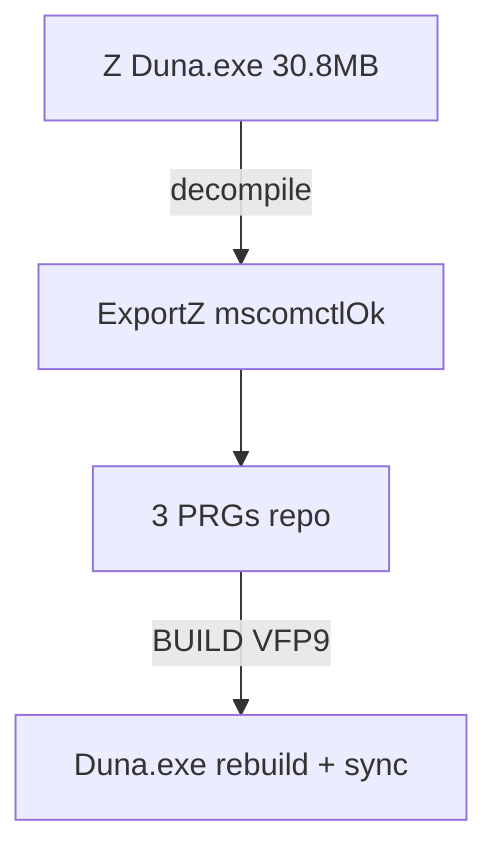

# Historial Style-Suite y plan ExportZ

Documento de continuidad para la integración **Style Dunasoft (VFP9)** ↔ **Suite** (sync agenda `plan2009`).

- **Referencia técnica de parches:** [STYLE-SUITE-PARCHES-EXPORT.md](STYLE-SUITE-PARCHES-EXPORT.md)
- **Guía maestra v2 (cola + Docker):** [STYLE-SUITE-SYNC-V2-IMPLEMENTACION.md](STYLE-SUITE-SYNC-V2-IMPLEMENTACION.md)
- **Arquitectura:** [STYLE-SUITE-ARCHITECTURE.md](STYLE-SUITE-ARCHITECTURE.md)
- **Base de build nueva:** `C:\Duna\ExportZ\` (decompile del `Duna.exe` de `Z:\Style-Dunasoft`)
- **Base descartada:** `C:\Duna\Export\` (export ReFox histórico; rebuild ~35 MB con error 1732)

---

## Objetivo

| Meta | Cómo |
|------|------|
| Sync bidireccional `plan2009` | `suite_full_unlock.prg` embebido + Edge Function `style-reservas-sync` |
| Arranque sin `IniciarStyle.bat` | Bootstrap en `general.prg` |
| Unlock offline Dunasoft | `SuiteApplyFullUnlock` |
| Build VFP9 nativo | `BUILD PROJECT mscomctlok` (ExportZ; archivo `mscomctlOk.pjx` en disco) |
| Sin error 1732 | Sin `.fxp` de unlock; sin `licencias_unlock` / `SuiteCreatePolicencias` |

**Canal recomendado (v2, local):** cola `cola_sincro.dbf` en VFP + agente Node.js (`style-sync-agent/`). Ver sección [Arquitectura cola + Node](#arquitectura-cola--node-recomendada).

**Canal legacy (v1):** VFP HTTP embebido → Edge Function `style-reservas-sync`. Mantener solo si no hay agente local. No usar en paralelo el agente Python `C:\SuiteSync`.

---

## Arquitectura cola + Node (recomendada)

Style **no debe** llamar a Supabase desde FoxPro. El patrón óptimo con código fuente y Supabase en la misma LAN:



| Paso | Quién | Qué |
|------|-------|-----|
| 1 | VFP | Tras `TABLEUPDATE()` OK → `SuiteEnqueuePlan2009(idplan, "UPD")` en `cola_sincro.dbf` (< 1 ms) |
| 2 | Node | Poll cola → lee `plan2009.dbf` → JSON → upsert Postgres → `procesado=.T.` |
| 3 | Node | Realtime INSERT en Suite → escribe cita en `plan2009.dbf` (bridge OLEDB/VFP) |

**Archivos repo:**

| Archivo | Rol |
|---------|-----|
| `vfp/suite_cola_sync.prg` | `SuiteEnsureColaSincro`, `SuiteEnqueueCola`, `SuiteEnqueuePlan2009` |
| `style-sync-agent/` | Agente Node (polling + Realtime); ver `.env.example` |

**Ventajas:** rendimiento POS intacto, cola offline si Supabase cae, depuración en TypeScript.

**Build ExportZ:** fase 1 = exe estable (bootstrap + unlock). Fase 2 = enganchar `suite_cola_sync.prg` en forms y desactivar timer HTTP de `suite_full_unlock` si el agente Node está activo.

---

## Arquitectura sync v1 (HTTP embebido, legacy)



| Pieza | Archivo repo |
|-------|----------------|
| Bootstrap arranque | `vfp/general.prg` |
| Sync + unlock | `vfp/suite_full_unlock.prg` |
| Loader embebido | `vfp/funciones.prg` |
| Config cliente | `SuiteSync.cfg` (plantilla `vfp/SuiteSync.cfg.example`) |
| Backend | `supabase/functions/style-reservas-sync/` + migraciones SQL |

Columnas DBF añadidas en runtime si faltan: `enviar`, `enviadoand`, `idand`, `macand`.

---

## Cronología: intento con `C:\Duna\Export` (fallido)

| Fase | Acción | Resultado |
|------|--------|-----------|
| Parches | 3 PRGs repo → `Export\PROGS\` | Compilación OK |
| Repair | `RepararProyectoSilent` + `suite_repair_lib.prg` | `suite_full_unlock` en `.pjx` |
| Build PM | `Duna.exe` ~35,6 MB (17/06/2026 17:18) | **1732** al arrancar; sin `[BOOT-00]` |
| Test | `Style-Suite-Test` + 87 `vcx\` | Sigue 1732 |
| Referencia | `Z:\Style-Dunasoft\Duna.exe` ~30,8 MB | Lipout OK; sync `[BOOT-07]` (sin unlock embebido) |

**Hipótesis del fallo Export:** el export ReFox histórico no coincide con el binario de producción Z; el rebuild cambió embebido / mezcla `.fxp`/`.prg` y rompe `SET CLASSLIB` o `SET PROCEDURE` antes del bootstrap.

---

## Por qué ExportZ

| Artefacto | Tamaño | Arranque | Proyecto |
|-----------|--------|----------|----------|
| `Z:\Style-Dunasoft\Duna.exe` | ~30,8 MB | OK | — |
| `C:\Duna\Export\Duna.exe` | ~35,6 MB | 1732 | `mscomctl.pjx` |
| `C:\Duna\ExportZ\` (decompile Z) | PRGs parcheados + compile OK | `mscomctlOk.pjx` (~161 KB) |

ExportZ = decompile del exe que **funciona en producción**. Los parches Suite se aplican encima de esa estructura.

**Audit ExportZ (junio 2026):**

- `mscomctlOk.pjx` / `.pjt` / `.lfn` (1638 entradas)
- `general.prg` ~41 KB, `funciones.prg` ~275 KB — **sin** símbolos `Suite_*`
- **No** existe `suite_full_unlock` hasta aplicar parches
- 83 archivos en `vcx\`; cada PRG de PROGS viene con su `.fxp` del decompile



---

## Scripts del repo

| Script | Uso |
|--------|-----|
| `scripts/build-style-exportz.ps1` | Pipeline ExportZ (preparar, repair, compile, post-build) |
| `scripts/setup-style-exportz-test.ps1` | Entorno test con exe ExportZ |
| `scripts/setup-style-from-z.ps1` | Test con exe Z (fallback Lipout) |
| `scripts/build-style-duna.ps1` | Pipeline legacy `C:\Duna\Export` |
| `scripts/copy-duna-exe.ps1` | `mscomctlOk.exe` / `mscomctl.exe` → `Duna.exe` |
| `scripts/ensure-style-dbc.ps1` | wedb en `dbf\` |
| `scripts/sync-style-config-from-z.ps1` | EMPRESA + `config.fpw` |

PRGs de build en `vfp/`: `VfpBuildProject.prg`, `VfpCompilePrgs.prg`, `suite_repair_lib.prg`, `RepararProyectoSilent.prg`.

---

## Lecciones / trampas

| Trampa | Efecto | Regla |
|--------|--------|-------|
| `PROGS\suite_full_unlock.fxp` | No registra `DEFINE CLASS` → **1732** | Solo `.prg`; borrar `.fxp` antes del build |
| `funciones.fxp` externo + exe Z | Loader embebido ignora FXP | Rebuild exe o no mezclar |
| Build Export ~35 MB | 1732 antes de bootstrap | Base = decompile Z (ExportZ) |
| `SET CLASSLIB` sin `vcx\` | 1732 (`pellib`, etc.) | Copiar `vcx\` de ExportZ al test |
| `wedb.dbc` en raíz | Error **2005** | Solo `dbf\wedb` |
| `NEWOBJECT("licencias_unlock")` | 1732 | `SuiteSafeCreateObject("licencias", ...)` |
| `config.fpw COMMAND` | No corre en exe compilado | `DEFAULT=ruta` |
| `BUILD PROJECT` headless | Falla en VFP9 | PM abierto + martillo |
| Bug `VfpBuildProject` L56 | `.Build` con `loProj` nulo | Corregido: `TYPE(loProj)="O"` |
| `suite_repair_lib` sin `Files.Add` unlock | `[BOOT-07]` | Añadir `suite_full_unlock.prg` al `.pjx` |

---

## Estado carpetas (snapshot)

| Ruta | Exe | Sync log |
|------|-----|----------|
| `Z:\Style-Dunasoft` | 30,8 MB OK | `[BOOT-07]` |
| `C:\Duna\Export` | 35,6 MB roto | No arranca |
| `C:\Duna\Style-Suite-Test` | según último deploy | Validar tras build ExportZ |
| `C:\Duna\ExportZ` | pendiente | — |

---

## Plan ExportZ — pasos

### 1. Preparación automatizada

```powershell
cd C:\Users\OportoW11\Suite\suite
.\scripts\build-style-exportz.ps1
```

Copia 3 PRGs, scripts de build, repair, compile `general`+`funciones`, borra `suite_full_unlock.fxp`.

### 2. Build manual (VFP9 IDE)

1. `File > Open Project > C:\Duna\ExportZ\mscomctlOk`
2. Consola VFP:

```foxpro
SET DEFAULT TO C:\Duna\ExportZ
DO PROGS\VfpCompilePrgs.prg
DO PROGS\VfpBuildProject.prg
```

3. Si falla el script: martillo **Build → Win32 executable** → `C:\Duna\ExportZ\`

### 3. Post-build

```powershell
.\scripts\build-style-exportz.ps1 -AfterBuild -DeployTest
```

### 4. Validación

```powershell
.\scripts\validate-style-exportz-build.ps1
```

Criterios:

- `Duna.exe` ~30–31 MB (no ~35 MB)
- Arranque sin 1732
- Log `Usuarios\_suite_sync.log`: `[BOOT-00]` → `[BOOT-04]` → `[INIT-03]`
- Cita Style ↔ Suite en ~30 s

### 5. Deploy VM (tras OK local)

```powershell
.\scripts\build-style-exportz.ps1 -AfterBuild -DeployVm
.\scripts\ensure-style-dbc.ps1 -RemoveWedbRootOnly
```

---

## Qué aplicar en ExportZ (fase 1)

| Bloque | Aplicar |
|--------|---------|
| Bootstrap `SuiteResolveStyleRoot` / `SuiteApplyStyleEnvironment` | Sí |
| `SuiteLoadUnlockFromFunciones` + sync push/pull | Sí |
| `SuiteGetHttpLocal` + `httpasp_local` | Sí |
| `SuiteSafeCreateObject` licencias/usuario | Sí |
| Timer estándar + `BINDEVENT` | Sí |
| `DEFINE CLASS licencias_unlock` | **No** |
| `SuiteCreatePolicencias` | **No** |
| Parches `http.vcx` | No (fase 1) |
| PROGS/FXP de `C:\Duna\Export` viejo | **No** |

---

## Qué NO replicar

- No mezclar `mscomctl.pjx` con `mscomctlOk.pjx`
- No desplegar exe Export ~35 MB roto
- No `suite_reservas_sync.prg` ni `suite_full_unlock.fxp` en runtime
- No tocar `Z:\Style-Dunasoft\Duna.exe` durante desarrollo

---

## Códigos de log

Ver tabla completa en [STYLE-SUITE-PARCHES-EXPORT.md](STYLE-SUITE-PARCHES-EXPORT.md). Claves:

| Código | Significado |
|--------|-------------|
| `[BOOT-04]` | Unlock/sync embebido OK |
| `[BOOT-07]` | Sync no en exe — rebuild |
| `[INIT-03]` | `SuiteSync.cfg` OK, timer activo |

---

## Fallback arranque Lipout (sin sync)

```powershell
Copy-Item Z:\Style-Dunasoft\Duna.exe C:\Duna\Style-Suite-Test\ -Force
.\scripts\setup-style-from-z.ps1 -DestRoot C:\Duna\Style-Suite-Test
```

---

*Última actualización: junio 2026 — migración de base Export → ExportZ (decompile Z).*
