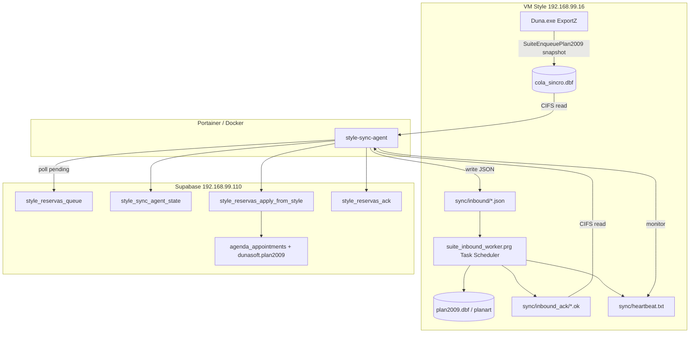

# Style ↔ Suite — Sincronización v2 (cola + agente Docker)

Documento maestro de implementación. Resume arquitectura, piezas del repo, fases de despliegue, operación y criterios de éxito.

**Documentos del proyecto:**

| Documento | Contenido |
|-----------|-----------|
| [STYLE-SUITE-ARCHITECTURE.md](STYLE-SUITE-ARCHITECTURE.md) | Reglas de oro, garantías, ownership, máquinas de estado |
| [STYLE-SUITE-DEPLOY.md](STYLE-SUITE-DEPLOY.md) | Despliegue por fases |
| [STYLE-SUITE-OPERATIONS.md](STYLE-SUITE-OPERATIONS.md) | Monitorización, heartbeat, dead-letter |
| [STYLE-SUITE-TROUBLESHOOTING.md](STYLE-SUITE-TROUBLESHOOTING.md) | Diagnóstico por síntoma |
| [STYLE-SUITE-HISTORY.md](STYLE-SUITE-HISTORY.md) | Cronología y lecciones |
| [STYLE-SUITE-HISTORIAL-Y-EXPORTZ.md](STYLE-SUITE-HISTORIAL-Y-EXPORTZ.md) | Detalle ExportZ |
| [style-sync-agent/README.md](../style-sync-agent/README.md) | Agente Node |

---

## 1. Objetivo

Integrar **Style Dunasoft (VFP9)** con **Suite** (agenda `plan2009`) con sync **bidireccional**, sin romper Lipout ni el POS local.

| Requisito | Solución v2 |
|-----------|-------------|
| Style guarda citas en < 1 ms | VFP solo encola en `cola_sincro.dbf` |
| Suite recibe cambios de Style | Agente Node → RPC Postgres |
| Style recibe citas de Suite | Cola Postgres → JSON → worker VFP → `plan2009.dbf` |
| Supabase caído | Cola local crece; catch-up al volver |
| Sin HTTP/MSXML en el exe | **No** embeber `suite_full_unlock.prg` en ExportZ |
| Despliegue del agente | Contenedor Docker en **Portainer** + volumen CIFS a la VM Style |

**Canal legacy (v1):** VFP HTTP → Edge Function `style-reservas-sync`. Mantener solo como fallback. **No** correr en paralelo con v2 ni con el agente Python `C:\SuiteSync`.

---

## 2. Arquitectura



### Principios de diseño

1. **VFP no llama a Supabase** — solo escribe cola local con snapshot de la cita.
2. **Node no escribe `plan2009.dbf`** desde Linux — inbound vía JSON + worker FoxPro.
3. **Progreso outbound sin escribir DBF** — cursor `last_cola_id` en Postgres (`style_sync_agent_state`).
4. **Cola con snapshot** — el agente no relee `plan2009.dbf` sobre CIFS (evita locks y lecturas frágiles).

---

## 3. Inventario de piezas (repo)

### 3.1 VFP / Style

| Archivo | Rol | En exe ExportZ |
|---------|-----|----------------|
| [vfp/general.prg](general.prg) | Bootstrap arranque | Sí |
| [vfp/funciones.prg](funciones.prg) | Hook `Reservas_Incidencia` → enqueue | Sí |
| [vfp/suite_cola_sync.prg](suite_cola_sync.prg) | Cola + snapshot `plan2009`/`planart` | Sí |
| [vfp/suite_inbound_worker.prg](suite_inbound_worker.prg) | Procesa JSON inbound, escribe DBF, heartbeat | **No** (Task Scheduler) |
| [vfp/suite_full_unlock.prg](suite_full_unlock.prg) | Sync HTTP legacy (timer MSXML) | **No** en v2 |
| [vfp/suite_repair_lib.prg](suite_repair_lib.prg) | Repair proyecto ExportZ | Solo build |
| [vfp/VfpBuildProject.prg](VfpBuildProject.prg) | Build exe headless | Solo build |
| [vfp/VfpCompilePrgs.prg](VfpCompilePrgs.prg) | Compila PRGs | Solo build |

### 3.2 Agente Node

| Ruta | Rol |
|------|-----|
| [style-sync-agent/src/index.ts](../style-sync-agent/src/index.ts) | Loop principal: outbound, inbound, ack, heartbeat |
| [style-sync-agent/src/fsRetry.ts](../style-sync-agent/src/fsRetry.ts) | Reintentos CIFS / DBF bloqueado |
| [style-sync-agent/Dockerfile](../style-sync-agent/Dockerfile) | Imagen `node:20-alpine` |
| [style-sync-agent/docker-compose.snippet.yml](../style-sync-agent/docker-compose.snippet.yml) | Fragmento para Portainer |
| [style-sync-agent/.env.example](../style-sync-agent/.env.example) | Variables de entorno |

### 3.3 Supabase (ya desplegado + nuevas migraciones)

| Migración | Rol |
|-----------|-----|
| `20260608120000_style_reservas_vfp_sync.sql` | `style_reservas_queue`, RPCs base |
| `20260609120000_style_reservas_lww.sql` | Last-write-wins inbound |
| `20260610130000_style_push_always_apply.sql` | Push Style → Suite siempre aplica |
| `20260617190000_style_sync_agent_state.sql` | Tabla `last_cola_id` |
| `20260617193000_style_sync_agent_health.sql` | Heartbeat, alertas inbound |

| Edge Function | Rol en v2 |
|---------------|-----------|
| [supabase/functions/style-reservas-sync/](../supabase/functions/style-reservas-sync/) | **Legacy** — fallback si no hay agente |

### 3.4 Scripts PowerShell

| Script | Uso |
|--------|-----|
| [scripts/build-style-exportz.ps1](../scripts/build-style-exportz.ps1) | Pipeline ExportZ: copiar PRGs, compile, post-build |
| [scripts/setup-style-exportz-test.ps1](../scripts/setup-style-exportz-test.ps1) | Entorno `C:\Duna\Style-Suite-Test` |
| [scripts/validate-style-exportz-build.ps1](../scripts/validate-style-exportz-build.ps1) | Validar exe (~30 MB, log bootstrap) |
| [scripts/deploy-migration.ps1](../scripts/deploy-migration.ps1) | Aplicar migraciones SQL en 110 |
| [scripts/deploy-edge-functions.ps1](../scripts/deploy-edge-functions.ps1) | Solo si se usa fallback HTTP |

---

## 4. Estructura en la VM Style

Ruta producción de referencia: `C:\Style-Dunasoft` o `Z:\Style-Dunasoft` (192.168.99.16).

```
Style-Dunasoft\
├── Duna.exe                    ← rebuild ExportZ
├── PROGS\
│   ├── suite_cola_sync.prg     ← embebido en exe
│   └── suite_inbound_worker.prg ← copia suelta para Task Scheduler
├── cola_sincro.dbf             ← creada en runtime por VFP
├── dbf\
│   ├── plan2009.dbf
│   └── planart.dbf
└── sync\
    ├── inbound\                ← agente escribe *.json
    ├── inbound_ack\            ← worker escribe *.ok
    ├── archive\
    │   ├── YYYY-MM-DD\         ← agente archiva tras ack OK
    │   └── failed\             ← JSON huérfanos >24h
    ├── heartbeat.txt           ← worker actualiza cada ejecución
    └── inbound_worker.log      ← errores del worker
```

---

## 5. Flujos detallados

### 5.1 Outbound (Style → Suite)

1. Usuario guarda/modifica/borra cita en agenda Style.
2. `Reservas_Incidencia` en `funciones.prg` llama `SuiteEnqueuePlan2009(idplan, accion)` con **snapshot** (campos de `plan2009` + servicios de `planart`).
3. Agente (poll ~1,5 s) lee `cola_sincro.dbf` con `dbf-reader` y backoff si el archivo está bloqueado.
4. Por cada fila con `id > last_cola_id`: RPC `style_reservas_apply_from_style(...)`.
5. Actualiza `dunasoft.style_sync_agent_state.last_cola_id`.

**Acciones en cola:** `INS` (crear), `UPD` (modificar), `DEL` (borrar).

### 5.2 Inbound (Suite → Style)

1. Suite dual-write encola fila en `dunasoft.style_reservas_queue` (`delivered_at IS NULL`).
2. Agente hace poll (~3 s) y escribe `sync/inbound/{queue_id}.json`.
3. Worker VFP (cada 30–60 s):
   - Actualiza `heartbeat.txt`
   - Lee JSON, aplica a `plan2009`/`planart` con `RLOCK`
   - Borra JSON procesado
   - Escribe `sync/inbound_ack/{queue_id}.ok`:
     ```text
     idand=<n>;idplan=<n>;macand=<s>;ok=1
     ```
4. Agente lee `.ok`, llama RPC `style_reservas_ack`, archiva JSON/.ok en `sync/archive/YYYY-MM-DD/`.

### 5.3 Resiliencia operativa

| Escenario | Comportamiento |
|-----------|----------------|
| Miles de JSON/.ok | Archivo automático tras ack; JSON huérfanos >24h → `archive/failed/` |
| Worker VFP caído | `heartbeat.txt` >5 min sin actualizar → `inbound_worker_status='stopped'` + mensaje en Postgres |
| Microcorte CIFS | `fsRetry.ts`: backoff 100ms, 200ms, …; contenedor no crashea |
| `cola_sincro.dbf` bloqueado | Mismo backoff en lectura (VFP en `APPEND BLANK`) |

---

## 6. Fases de implementación

### Fase 0 — Build ExportZ (prerrequisito)

**Entornos:**

| Ruta | Uso |
|------|-----|
| `Z:\Style-Dunasoft` | Producción referencia (no tocar) |
| `C:\Duna\ExportZ` | Decompile Z + parches |
| `C:\Duna\Export` | **Descartado** (1732) |
| `C:\Duna\Style-Suite-Test` | Pruebas |

**Pasos:**

```powershell
cd C:\Users\OportoW11\Suite\suite
.\scripts\build-style-exportz.ps1
```

En VFP9 (Project Manager abierto en `C:\Duna\ExportZ\mscomctlOk`):

```foxpro
SET DEFAULT TO C:\Duna\ExportZ
DO PROGS\VfpCompilePrgs.prg
DO PROGS\VfpBuildProject.prg
```

Post-build:

```powershell
.\scripts\build-style-exportz.ps1 -AfterBuild -DeployTest
```

**Checklist Fase 0:**

- [ ] `Duna.exe` ~30–31 MB (no ~35 MB)
- [ ] Arranque Lipout sin error 1732
- [ ] Log `Usuarios\_suite_sync.log` con `[BOOT-04] suite_cola_sync`
- [ ] **Sin** `[BOOT-07]` (falta unlock HTTP)
- [ ] **Sin** `suite_full_unlock` embebido en el proyecto

---

### Fase 1 — Backend + agente outbound

**Migraciones (orden):**

```powershell
.\scripts\deploy-migration.ps1 20260617190000_style_sync_agent_state.sql
.\scripts\deploy-migration.ps1 20260617193000_style_sync_agent_health.sql
```

**Agente local (desarrollo):**

```powershell
cd style-sync-agent
copy .env.example .env
# Editar: SUPABASE_SERVICE_ROLE_KEY, COMPANY_ID, STYLE_ROOT
npm install
npm run dev
```

**Prueba outbound:**

1. Guardar cita en Style-Suite-Test.
2. Verificar fila nueva en `cola_sincro.dbf`.
3. Verificar en logs del agente: `procesar plan2009 id=...`.
4. Verificar cita en Suite (agenda web).

**Checklist Fase 1:**

- [ ] Migraciones aplicadas (`OK` en deploy script)
- [ ] `last_cola_id` avanza en `dunasoft.style_sync_agent_state`
- [ ] Cita Style → visible en Suite < 10 s

---

### Fase 2 — Inbound (worker VFP)

**Copiar worker a Style:**

```powershell
Copy-Item vfp\suite_inbound_worker.prg \\192.168.99.16\c$\Style-Dunasoft\PROGS\
```

**Task Scheduler (VM Style):**

- Programa: `C:\Program Files (x86)\Microsoft Visual FoxPro 9\vfp9.exe`
- Argumentos: `"C:\Style-Dunasoft\PROGS\suite_inbound_worker.prg"`
- Repetir cada **30–60 segundos** (aunque no haya JSON)
- Ejecutar aunque el usuario no haya iniciado sesión

**Prueba inbound:**

1. Crear cita en Suite (agenda web).
2. Verificar `sync/inbound/{id}.json` en Style.
3. Tras worker: cita en agenda Style.
4. Verificar ack archivado y `delivered_at` en `style_reservas_queue`.

**Checklist Fase 2:**

- [ ] `heartbeat.txt` se actualiza cada minuto
- [ ] `inbound_worker_status = 'ok'` en Postgres
- [ ] Cita Suite → Style < 15 s

---

### Fase 3 — Docker / Portainer (producción)

**Build imagen:**

```powershell
cd style-sync-agent
docker build -t style-sync-agent:latest .
```

**Stack Portainer:** pegar/adaptar [docker-compose.snippet.yml](../style-sync-agent/docker-compose.snippet.yml).

**Volumen CIFS:**

```yaml
device: "//192.168.99.16/c$/Style-Dunasoft"
```

**Secretos en Portainer:**

| Variable | Valor |
|----------|-------|
| `STYLE_SYNC_SERVICE_ROLE_KEY` | service_role de Supabase |
| `STYLE_SYNC_COMPANY_ID` | UUID de la empresa |

**Checklist Fase 3:**

- [ ] Contenedor `running`, logs sin errores RPC
- [ ] CIFS montado (`STYLE_ROOT=/style` legible)
- [ ] Outbound + inbound E2E en producción
- [ ] Desactivar timer HTTP legacy en Style (no `suite_full_unlock` en exe prod)
- [ ] Parar agente Python legacy `C:\SuiteSync` si existía

---

## 7. Variables de entorno (agente)

| Variable | Default | Descripción |
|----------|---------|-------------|
| `STYLE_ROOT` | `C:\Duna\Style-Suite-Test` | Raíz Style (en Docker: `/style`) |
| `SUPABASE_URL` | — | `https://supabase.lipoout.com` |
| `SUPABASE_SERVICE_ROLE_KEY` | — | Obligatorio |
| `COMPANY_ID` | — | UUID empresa |
| `POLL_MS` | `1500` | Poll cola outbound |
| `INBOUND_POLL_MS` | `3000` | Poll queue + acks |
| `INBOUND_BATCH` | `50` | Máx. filas inbound por ciclo |
| `INBOUND_DIR` | `{STYLE_ROOT}/sync/inbound` | JSON entrantes |
| `INBOUND_ACK_DIR` | `{STYLE_ROOT}/sync/inbound_ack` | Confirmaciones worker |
| `ARCHIVE_DIR` | `{STYLE_ROOT}/sync/archive` | Histórico procesados |
| `HEARTBEAT_PATH` | `{STYLE_ROOT}/sync/heartbeat.txt` | Monitor worker |
| `HEARTBEAT_CHECK_MS` | `60000` | Frecuencia chequeo heartbeat |
| `HEARTBEAT_STALE_MS` | `300000` | Alerta si >5 min sin heartbeat |
| `FS_RETRY_MAX` | `6` | Reintentos CIFS/DBF |
| `FS_RETRY_BASE_MS` | `100` | Base exponential backoff |
| `STALE_INBOUND_MS` | `86400000` | JSON huérfanos → failed (24h) |

---

## 8. Esquema `cola_sincro.dbf`

Creada por `SuiteEnsureColaSincro` si no existe:

| Campo | Tipo | Uso |
|-------|------|-----|
| `id` | N(10) | Secuencial local |
| `tabla_afectada` | C(40) | `plan2009` |
| `id_registro` | C(30) | `idplan` |
| `accion` | C(3) | `INS` / `UPD` / `DEL` |
| `procesado` | L | Legacy; v2 usa `last_cola_id` en Postgres |
| `creado` | T | Timestamp encolado |
| `codemp` … `collet` | varios | Snapshot cita |
| `servicios` | M | JSON array `planart`: `[{"servicio":"…","hora":"…"}]` |
| `style_modified_at` | C(20) | Epoch/modificado para RPC |
| `version` | N(10) | Versión LWW (epoch o secuencial) |

> Migración segura: ejecutar `DO PROGS\suite_migrar_cola_sincro.prg` (o `SuiteMigrarColaSincroInline` al encolar) para `ALTER TABLE` de columnas snapshot **sin borrar** la cola. Solo borrar en test si se quiere empezar de cero.

---

## 9. Monitorización y alertas

### Postgres (`dunasoft.style_sync_agent_state`)

| Columna | Significado |
|---------|-------------|
| `last_cola_id` | Última fila de cola procesada (outbound) |
| `agent_last_tick_at` | Último ciclo del agente Node |
| `inbound_worker_last_seen_at` | mtime de `heartbeat.txt` |
| `inbound_worker_status` | `ok` \| `stopped` \| `unknown` |
| `inbound_worker_alert_message` | Texto alerta (ej. «Sincronización Inbound Detenida») |
| `last_outbound_lag_ms` | `NOW() - cola_sincro.creado` del último outbound OK |
| `last_inbound_lag_ms` | `NOW() - style_reservas_queue.created_at` del último ACK OK |

**Alerta de degradación:** si `last_*_lag_ms > 30000` sin `inbound_worker_status = stopped`, investigar CIFS o carga.

**Consulta rápida:**

```sql
SELECT company_id, last_cola_id, inbound_worker_status,
       inbound_worker_alert_message, agent_last_tick_at,
       inbound_worker_last_seen_at
FROM dunasoft.style_sync_agent_state;
```

### Ficheros en Style

| Fichero | Qué mirar |
|---------|-----------|
| `sync/inbound_worker.log` | Errores JSON/DBF del worker |
| `Usuarios\_suite_sync.log` | Bootstrap exe (`[BOOT-04]`) |
| `sync/inbound/` | JSON pendientes (deberían ser pocos) |
| `sync/archive/failed/` | JSON que nadie procesó en 24h |

### Alertas recomendadas (Suite / ops)

- `inbound_worker_status = 'stopped'` → notificar operaciones
- `cola_sincro` con muchas filas y `last_cola_id` estancado → agente caído o CIFS roto
- `style_reservas_queue` con `delivered_at IS NULL` y edad > 15 min → inbound atascado

---

## 10. Plan de pruebas E2E

| # | Acción | Resultado esperado |
|---|--------|-------------------|
| 1 | Crear cita en Style | Fila en cola < 2 s; cita en Suite < 10 s |
| 2 | Modificar cita en Style | Mismo `idplan`, datos actualizados en Suite |
| 3 | Borrar cita en Style | Cita cancelada/eliminada en Suite |
| 4 | Crear cita en Suite | JSON en `sync/inbound/`; cita en Style < 15 s |
| 5 | Modificar cita en Suite (LWW) | Style refleja cambio si Suite es más reciente |

**Notas prueba #5 (LWW):**

1. Crear cita en Suite → llega a Style con `version=1`.
2. Modificar en Style con `version` forzado más antiguo → Suite ignora en outbound; inbound de Suite prevalece en Style.
3. Modificar en Suite con `version=2` → Style aplica.
4. Modificar en Style con `version=3` → Suite aplica vía cola.
5. Verificar que siempre hay `.ok` en `inbound_ack` aunque Style pierda el conflicto (`applied=0`).
| 6 | Apagar Supabase 30 min | Style guarda local; cola crece; catch-up al volver |
| 7 | Parar worker VFP 10 min | Alerta `stopped` en Postgres |
| 8 | Reiniciar contenedor agente | Sin duplicados (idempotencia `last_cola_id`) |
| 9 | Lipout arranca | Sin 1732; exe ~30 MB |

---

## 11. Cutover producción (v1 → v2)

Orden recomendado:

1. Aplicar migraciones `style_sync_agent_state` + health + lag (`20260617210000`).
2. Desplegar agente Docker con CIFS a Style prod (solo lectura cola + escritura `sync/`).
3. Copiar `suite_inbound_worker.prg`, `suite_control_sync.prg`, `suite_migrar_cola_sincro.prg` y crear Task Scheduler.
4. `DO suite_migrar_cola_sincro.prg` si la cola antigua no tiene columnas snapshot.
5. Crear `control_sincro.dbf` con `modo_activo='2'`.
6. Verificar E2E en horario de baja actividad.
7. **Pre-deploy binario:** `.\scripts\verify-style-cutover.ps1 -Backup` (confirma v1 tiene `suite_full_unlock` y el nuevo exe no).
8. Desplegar `Duna.exe` ExportZ **sin** `suite_full_unlock`.
9. Confirmar que **no** corre `C:\SuiteSync` ni timer HTTP.
10. Mantener Edge Function `style-reservas-sync` deshabilitada.

**Rollback:** restaurar `Duna.exe.v1.legacy.bak`, `modo_activo='1'`, parar contenedor agente, reactivar v1 HTTP.

---

## 12. Qué NO hacer

- No mezclar `C:\Duna\Export` con `ExportZ` ni `mscomctl.pjx` con `mscomctlOk.pjx`
- No embeber `suite_full_unlock` si el agente Docker está activo
- No escribir `plan2009.dbf` desde Node en Linux
- No correr agente Python legacy en paralelo
- No usar ReFox Replace
- No dejar miles de JSON en `sync/inbound/` (el archivado es automático tras ack)
- No programar el worker solo «cuando hay citas» — el heartbeat debe latir siempre

---

## 13. Estado de implementación (repo)

| Componente | Estado |
|------------|--------|
| `suite_cola_sync.prg` + snapshot JSON + `version` | Hecho |
| `suite_migrar_cola_sincro.prg` (ALTER sin borrar) | Hecho |
| `suite_control_sync.prg` (kill switch) | Hecho |
| Hook `Reservas_Incidencia` → enqueue | Hecho |
| Build ExportZ sin `suite_full_unlock` | Hecho (falta build manual usuario) |
| Agente Node outbound + inbound + ack + lag + kill switch | Hecho |
| `servicios.ts` JSON → legacy RPC | Hecho |
| `fsRetry.ts` (CIFS / DBF) | Hecho |
| Heartbeat + alertas Postgres | Hecho |
| Archivo JSON/.ok tras ack | Hecho |
| `suite_inbound_worker.prg` LWW + ACK siempre + recycle failed | Hecho (v1.1.0) |
| `verify-style-cutover.ps1` | Hecho |
| Dockerfile + compose Portainer | Hecho |
| Migraciones SQL agent state + health + lag | En repo (pendiente deploy 110) |
| UI Suite: panel alertas sync | **Pendiente** (opcional) |
| Build exe validado en test/prod | **Pendiente** (usuario VFP IDE) |
| Task Scheduler prod VM 192.168.99.16 | **Pendiente** (ops) |
| Stack Portainer prod | **Pendiente** (ops) |

---

## 14. Comandos rápidos de referencia

```powershell
# Preparar ExportZ
cd C:\Users\OportoW11\Suite\suite
.\scripts\build-style-exportz.ps1

# Post-build + test
.\scripts\build-style-exportz.ps1 -AfterBuild -DeployTest

# Migraciones agente
.\scripts\deploy-migration.ps1 20260617190000_style_sync_agent_state.sql
.\scripts\deploy-migration.ps1 20260617193000_style_sync_agent_health.sql
.\scripts\deploy-migration.ps1 20260617200000_style_sync_agent_metrics.sql
.\scripts\deploy-migration.ps1 20260617210000_style_sync_agent_lag.sql

# Pre-cutover binario
.\scripts\verify-style-cutover.ps1 -NewExe "C:\Duna\ExportZ\Duna.exe" -Backup

# Agente local
cd style-sync-agent
npm install && npm run dev

# Imagen Docker
docker build -t style-sync-agent:latest style-sync-agent
```

```foxpro
* Encolar manualmente (debug)
SET PROCEDURE TO suite_cola_sync ADDITIVE
= SuiteEnqueuePlan2009(12345, "UPD")

* Ejecutar worker inbound manualmente
DO C:\Style-Dunasoft\PROGS\suite_inbound_worker.prg
```

---

## 15. Contacto infraestructura

| Rol | Host | Notas |
|-----|------|-------|
| Supabase | `192.168.99.110` / `suite-supabase` | Postgres, RPCs, Edge Functions |
| Frontend Suite | `192.168.99.112` / `suite-web` | `https://suite.lipoout.com` |
| VM Style | `192.168.99.16` | `\\192.168.99.16\c$\Style-Dunasoft` |
| Portainer | (tu servidor) | Contenedor `style-sync-agent` + CIFS |

---

*Última actualización: junio 2026 — arquitectura v2 cola + agente Docker.*
